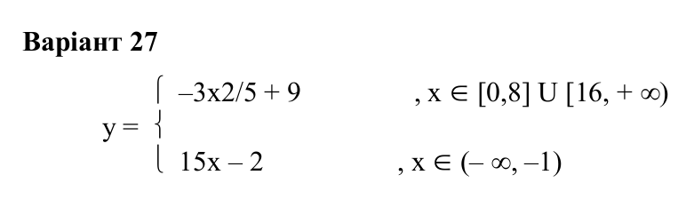
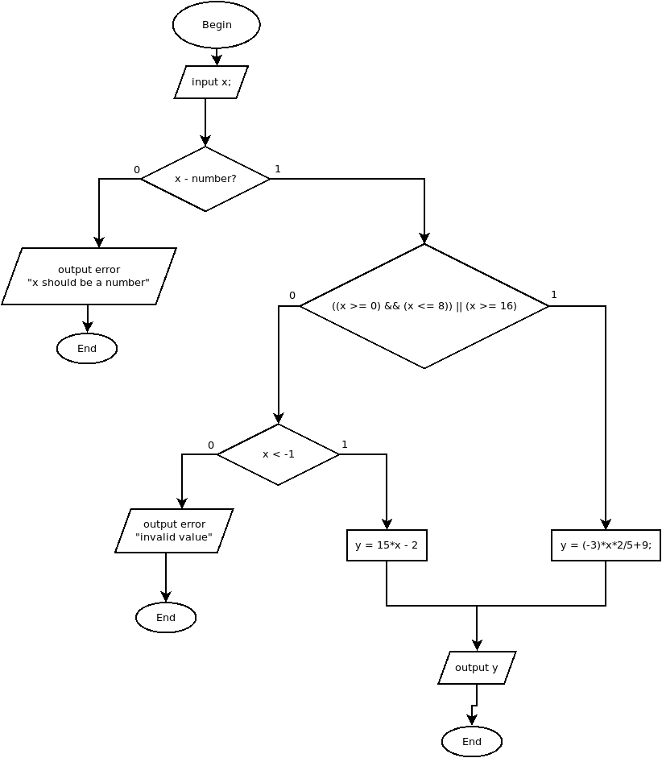
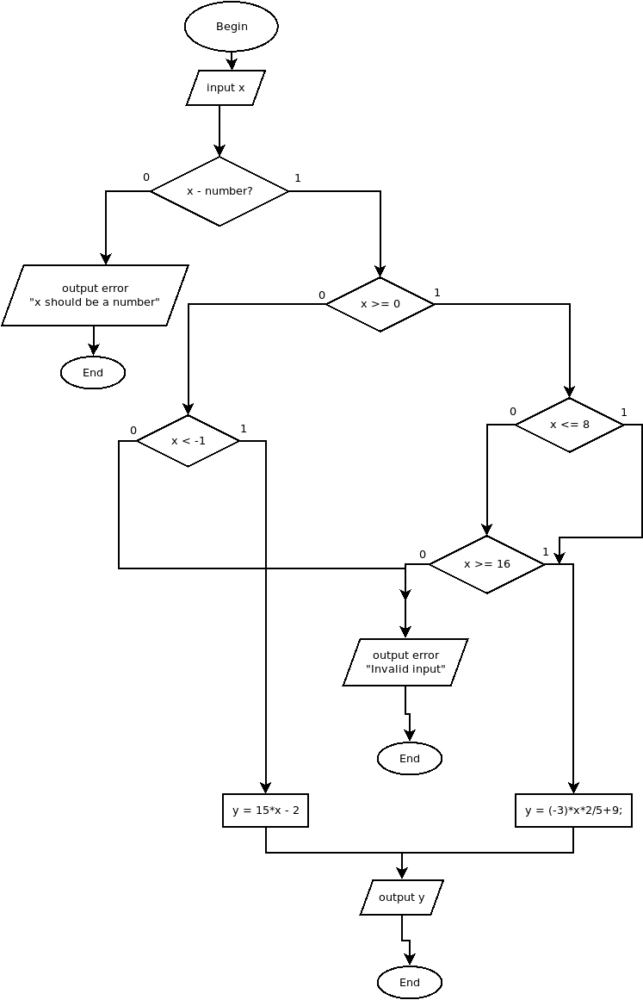

# Лабораторна работа №1.1: розгалужені алгоритми

## Мета лабораторної работи

Метою лабораторної роботи No1.1\. «Розгалужені алгоритми» є засвоєння теоретичного матеріалу та набуття практичних навичок використання керуючих конструкцій розгалуження та булевих (ло- гічних) операцій.

## Постановка задачі

Задано дійсне число x. Визначити значення заданої за варі- антом кусочно-безперервної функції y(x), якщо воно існує, або вивести на екран повідомлення про неіснування функції для за- даного x. Розв'язати задачу двома способами (написати дві програми):

1. в програмі дозволяється використовувати тільки одиничні операції порівняння (=, <>, <, <=, >, >=) і не дозволяється викори- стовувати булеві (логічні) операції (not, and, or, тощо);
2. в програмі необхідно обов'язково використати булеві (логічні) операції (not, and, or, тощо); використання булевих операцій не повинно бути надлишковим.

## Індивідуальне завдання



## Тексти програм

```c
// main.c
#include <stdio.h>

int main(){
    float x, y;

    printf("Enter x:\n> ");
    if (scanf("%e", &x) != 1){
        printf("Invalid input. x should be a number!\n");
        return 1;
    }

    if (((x >= 0) && (x <= 8)) || (x >= 16)) {
        y = (-3)*x*2/5+9;
    } else {
        if (x < -1){
            y = 15*x - 2;
        } else {
            printf("Invalid input. x should be:\n");
            printf(" - lower than (-1)\n");
            printf(" - in range [0;8]\n");
            printf(" - higher than 16\n");
            return 1;
        }
    }
    printf("y = %f\n", y);
    return 0;
}
```

```c
// main2.c
#include <stdio.h>

int main(){
    float x, y;

    printf("Enter x:\n> ");
    if (scanf("%e", &x) != 1){
        printf("Invalid input. x should be a number!\n");
        return 1;
    }

    if (x >= 0){
        if (x <= 8){
            y = (-3)*x*2/5+9;
        } else if (x >= 16){
            y = (-3)*x*2/5+9;
        } else {
            printf("Invalid input. x should be:\n");
            printf(" - lower than (-1)\n");
            printf(" - in range [0;8]\n");
            printf(" - higher than 16\n");
            return 1;
        }
    } else if (x < -1){
        y = 15*x -2;
    } else {
        printf("Invalid input. x should be:\n");
        printf(" - lower than (-1)\n");
        printf(" - in range [0;8]\n");
        printf(" - higher than 16\n");
        return 1;
    }

    printf("y = %f\n", y);
    return 0;
}
```

## Результати тестування

Проаналізувавши алгоритм програми я вирішив обрати наступні тестові дані:

```
8; 20.7; -3; "qwerty"; 10
```

Для обох програм результати тестування виявилися однаковими:

```
Enter x:
> 8
y = -0.600000

Enter x:
> 20.7
y = -15.840000

Enter x:
> -3
y = -47.000000

Enter x:
> qwerty
Invalid input. x should be a number!

Enter x:
> 10
Invalid input. x should be:
 - lower than (-1)
 - in range [0;8]
 - higher than 16
```

## Діаграми

main.c:



main2.c:

